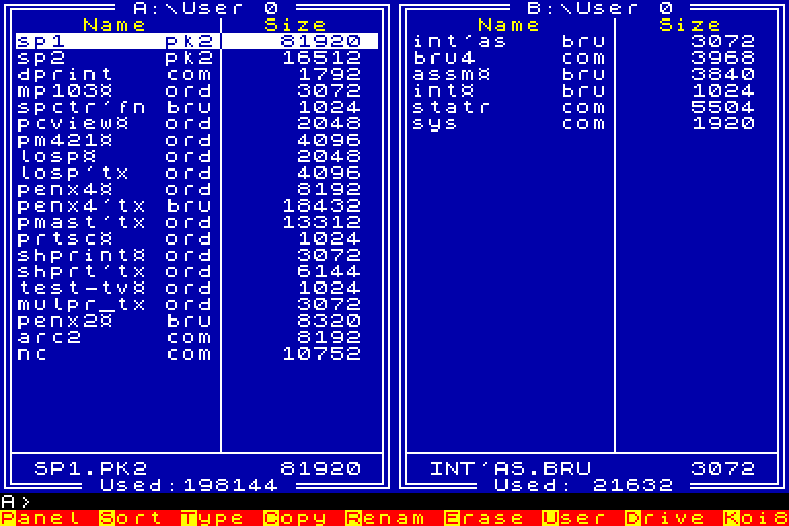

# orion128

An emulator of the Orion-128, a home computer built around the KR580VM80A
processor (an i8080 clone).

[](https://github.com/kosarev/orion128/actions/workflows/python-package.yml)
[](https://pypi.org/project/orion128/)
[](https://pypi.org/project/orion128/)
[](https://github.com/kosarev/orion128/blob/main/LICENSE)

orion128 emulates the hardware — memory-mapped video, the keyboard, ports and
the disk controller — and runs the real ROM and software on top of it. It is
built on the [z80](https://github.com/kosarev/z80) package for the i8080 core
and aims to stay in pure Python. The display is built on PySDL2 and numpy.

Norton Commander (NC.COM) running under CP/M, booted from a disk image:



It ships with the MS7007 Monitor and an ORDOS 4.03 ROM-disk, so it boots a
working system out of the box:

```shell
orion128
```

`--rk86` selects the RK-86 keyboard machine, with its own Monitor and
keyboard layout, for software written for that keyboard. `--monitor PATH`
and `--romdisk PATH` replace the bundled ROMs.

Each extra argument is a file the emulator loads. An ORDOS program (`.ORD`
or `.BRU`) is placed on the RAM-disk (drive B:). A disk image is put in a
floppy drive; give several to fill the drives in turn:

```shell
orion128 PENX4$.ORD
orion128 system.img data.img
```

With a disk in the drive the Orion's own disk software runs: the ORDOS file
manager copies files to and from disks, and CP/M boots from a system disk.
Changes to a disk are kept in memory, so your image files are left as they
are.

<kbd>F12</kbd> is the RESET button. <kbd>F10</kbd> closes the emulator.

Each PC key is mapped to the Orion key that gives the same character, so
`:`, `;` and `#` come out as expected, even though the Orion's own keyboard
is laid out quite differently. Old games that scan the keyboard ports
directly, like Manic Miner, keep working too.

The bundled ROMs are the copyright of their original authors and are not
covered by this package's MIT licence; see `orion128/ROMS.txt`.

This is early work in progress.
